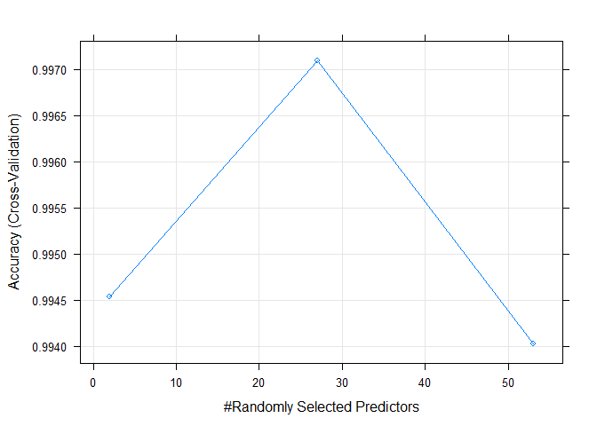
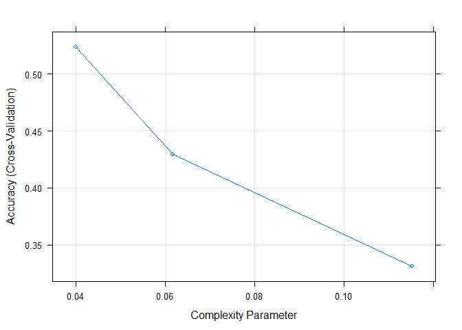
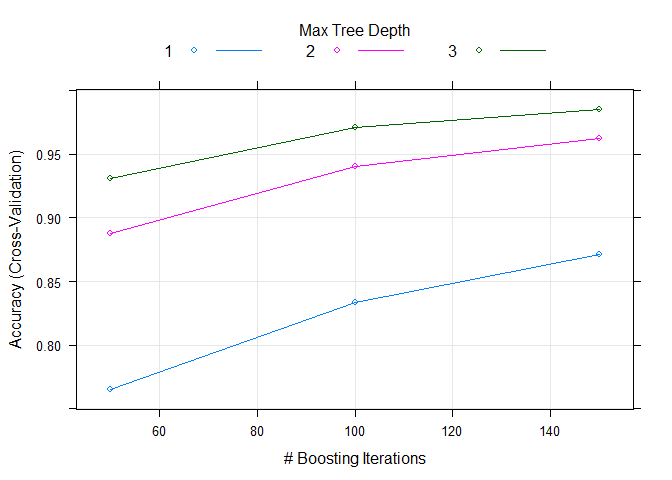
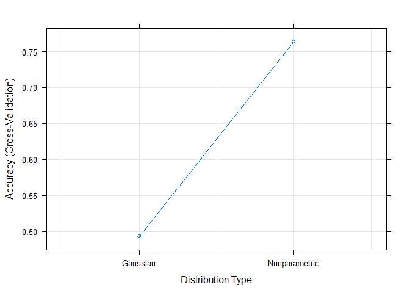

# Machine Learning Course Project
Erik Johnson  
November 21, 2017  


## Synopsis
In this project, we aim to create a model that predicts how well people perform various barbell lifts, given data from accelerometers on the belt, forearm, arm, and dumbell. Specifically, we aim to classify whether they perform the lifts correctly, or incorrectly in one of 5 different ways. Using the dataset provided for the project, we built a random forest model that achieves an estimated out-of-sample error rate of 0.27%.

## Data Preparation
We start by loading the data from the file.

```r
library(caret)
```

```r
rawData <- read.csv("pml-training.csv")
```

Next, we remove near-zero valued columns, descriptive columns that don't contribute to the prediction (e.g., timestamp), and columns with almost all NA values.

```r
# Look for near-zero variables
nzv <- nearZeroVar(rawData,saveMetrics=TRUE)
# Remove near-zero variables
dat <- rawData[,nzv$nzv == FALSE]
```

```r
# Remove descriptive variables
descriptiveColumns <- grepl("X|user_name|raw_timestamp_part_1|raw_timestamp_part_2|cvtd_timestamp", names(dat))
dat <- dat[,!descriptiveColumns]
```

```r
# Get the percent of NA values for each column
colNAPercentages <- sapply(names(dat), function(colName){sum(is.na(dat[[colName]]))/nrow(dat)})
# Keep columns with less than 97% NA values
dat <- dat[,names(colNAPercentages[colNAPercentages < 0.97])]
```

We finish our data preparation by partitioning the data into training and test sets.

```r
# Create training and testing partitions
set.seed(32465)
inTrain <- createDataPartition(y=dat$classe, p=0.7, list=FALSE)
training <- dat[inTrain,]
testing <- dat[-inTrain,]
```

## Model Building
Our strategy of model creation is to try several models and pick the one with the best accuracy. Since this is a non-linear problem, we only try models that perform best in non-linear scenarios: random forests, decision trees, boosting with trees, naive bayes, and linear discriminant analysis.

For each model, we estimate its out-of-sample accuracy and error by predicting on the testing data partition. We use 10-fold cross-validation to reduce bias.


```r
trControl <- trainControl(method="cv", 10)
```

### Random Forest

```r
# Train a random forest model
fitRF <- train(classe ~ ., data=training, method="rf", trControl=trControl)
```

```r
# Check the accuracy on the testing partition
predFitRF <- predict(fitRF, testing)
confFitRF <- confusionMatrix(testing$classe, predFitRF); confFitRF;
```

```
## Confusion Matrix and Statistics
## 
##           Reference
## Prediction    A    B    C    D    E
##          A 1674    0    0    0    0
##          B    5 1133    1    0    0
##          C    0    1 1022    3    0
##          D    0    0    3  961    0
##          E    0    0    0    3 1079
## 
## Overall Statistics
##                                           
##                Accuracy : 0.9973          
##                  95% CI : (0.9956, 0.9984)
##     No Information Rate : 0.2853          
##     P-Value [Acc > NIR] : < 2.2e-16       
##                                           
##                   Kappa : 0.9966          
##  Mcnemar's Test P-Value : NA              
## 
## Statistics by Class:
## 
##                      Class: A Class: B Class: C Class: D Class: E
## Sensitivity            0.9970   0.9991   0.9961   0.9938   1.0000
## Specificity            1.0000   0.9987   0.9992   0.9994   0.9994
## Pos Pred Value         1.0000   0.9947   0.9961   0.9969   0.9972
## Neg Pred Value         0.9988   0.9998   0.9992   0.9988   1.0000
## Prevalence             0.2853   0.1927   0.1743   0.1643   0.1833
## Detection Rate         0.2845   0.1925   0.1737   0.1633   0.1833
## Detection Prevalence   0.2845   0.1935   0.1743   0.1638   0.1839
## Balanced Accuracy      0.9985   0.9989   0.9976   0.9966   0.9997
```

```r
plot(fitRF)
```

<!-- -->

### Decision Trees

```r
# Train a decision tree model
fitRPart <- train(classe ~ ., data=training, method="rpart", trControl=trControl)
```

```r
# Check the accuracy on the testing partition
predFitRPart <- predict(fitRPart, testing)
confFitRPart <- confusionMatrix(testing$classe, predFitRPart); confFitRPart;
```

```
## Confusion Matrix and Statistics
## 
##           Reference
## Prediction    A    B    C    D    E
##          A 1518   36  115    0    5
##          B  531  364  244    0    0
##          C  487   39  500    0    0
##          D  445  172  347    0    0
##          E  168  136  288    0  490
## 
## Overall Statistics
##                                           
##                Accuracy : 0.488           
##                  95% CI : (0.4752, 0.5009)
##     No Information Rate : 0.5351          
##     P-Value [Acc > NIR] : 1               
##                                           
##                   Kappa : 0.3294          
##  Mcnemar's Test P-Value : NA              
## 
## Statistics by Class:
## 
##                      Class: A Class: B Class: C Class: D Class: E
## Sensitivity            0.4821  0.48728  0.33467       NA  0.98990
## Specificity            0.9430  0.84916  0.88021   0.8362  0.89017
## Pos Pred Value         0.9068  0.31958  0.48733       NA  0.45287
## Neg Pred Value         0.6127  0.91930  0.79543       NA  0.99896
## Prevalence             0.5351  0.12693  0.25387   0.0000  0.08411
## Detection Rate         0.2579  0.06185  0.08496   0.0000  0.08326
## Detection Prevalence   0.2845  0.19354  0.17434   0.1638  0.18386
## Balanced Accuracy      0.7125  0.66822  0.60744       NA  0.94003
```

```r
plot(fitRPart)
```

<!-- -->

### Boosting With Trees

```r
# Train a boosting with trees model
fitGBM <- train(classe ~ ., data=training, method="gbm", trControl=trControl, verbose=FALSE)
```

```r
# Check the accuracy on the testing partition
predFitGBM <- predict(fitGBM, testing)
confFitGBM <- confusionMatrix(testing$classe, predFitGBM); confFitGBM;
```

```
## Confusion Matrix and Statistics
## 
##           Reference
## Prediction    A    B    C    D    E
##          A 1673    1    0    0    0
##          B    7 1117   12    3    0
##          C    0   10 1004   11    1
##          D    0    7   14  943    0
##          E    0    6    1    9 1066
## 
## Overall Statistics
##                                           
##                Accuracy : 0.9861          
##                  95% CI : (0.9827, 0.9889)
##     No Information Rate : 0.2855          
##     P-Value [Acc > NIR] : < 2.2e-16       
##                                           
##                   Kappa : 0.9824          
##  Mcnemar's Test P-Value : NA              
## 
## Statistics by Class:
## 
##                      Class: A Class: B Class: C Class: D Class: E
## Sensitivity            0.9958   0.9790   0.9738   0.9762   0.9991
## Specificity            0.9998   0.9954   0.9955   0.9957   0.9967
## Pos Pred Value         0.9994   0.9807   0.9786   0.9782   0.9852
## Neg Pred Value         0.9983   0.9949   0.9944   0.9953   0.9998
## Prevalence             0.2855   0.1939   0.1752   0.1641   0.1813
## Detection Rate         0.2843   0.1898   0.1706   0.1602   0.1811
## Detection Prevalence   0.2845   0.1935   0.1743   0.1638   0.1839
## Balanced Accuracy      0.9978   0.9872   0.9846   0.9860   0.9979
```

```r
plot(fitGBM)
```

<!-- -->

### Naive Bayes

```r
# Train a naive bayes model
fitNB <- train(classe ~ ., data=training, method="nb", trControl=trControl)
```

```r
# Check the accuracy on the testing partition
predFitNB <- predict(fitNB, testing)
```

```r
confFitNB <- confusionMatrix(testing$classe, predFitNB); confFitNB;
```

```
## Confusion Matrix and Statistics
## 
##           Reference
## Prediction    A    B    C    D    E
##          A 1522   30   31   85    6
##          B  230  756  111   38    4
##          C  184   78  728   34    2
##          D  130    2  155  638   39
##          E   66   99   39   40  838
## 
## Overall Statistics
##                                           
##                Accuracy : 0.7616          
##                  95% CI : (0.7505, 0.7724)
##     No Information Rate : 0.3623          
##     P-Value [Acc > NIR] : < 2.2e-16       
##                                           
##                   Kappa : 0.6954          
##  Mcnemar's Test P-Value : < 2.2e-16       
## 
## Statistics by Class:
## 
##                      Class: A Class: B Class: C Class: D Class: E
## Sensitivity            0.7139   0.7834   0.6842   0.7641   0.9426
## Specificity            0.9595   0.9222   0.9382   0.9354   0.9512
## Pos Pred Value         0.9092   0.6637   0.7096   0.6618   0.7745
## Neg Pred Value         0.8551   0.9560   0.9308   0.9600   0.9894
## Prevalence             0.3623   0.1640   0.1808   0.1419   0.1511
## Detection Rate         0.2586   0.1285   0.1237   0.1084   0.1424
## Detection Prevalence   0.2845   0.1935   0.1743   0.1638   0.1839
## Balanced Accuracy      0.8367   0.8528   0.8112   0.8498   0.9469
```

```r
plot(fitNB)
```

<!-- -->

### Linear Discriminant Analysis

```r
# Train a linear discriminant analysis model
fitLDA <- train(classe ~ ., data=training, method="lda", trControl=trControl)
```

```r
# Check the accuracy on the testing partition
predFitLDA <- predict(fitLDA, testing)
confFitLDA <- confusionMatrix(testing$classe, predFitLDA); confFitLDA;
```

```
## Confusion Matrix and Statistics
## 
##           Reference
## Prediction    A    B    C    D    E
##          A 1389   52  106  123    4
##          B  171  740  139   41   48
##          C   85   98  688  120   35
##          D   52   40  134  696   42
##          E   50  147   82  111  692
## 
## Overall Statistics
##                                          
##                Accuracy : 0.7145         
##                  95% CI : (0.7028, 0.726)
##     No Information Rate : 0.2969         
##     P-Value [Acc > NIR] : < 2.2e-16      
##                                          
##                   Kappa : 0.6387         
##  Mcnemar's Test P-Value : < 2.2e-16      
## 
## Statistics by Class:
## 
##                      Class: A Class: B Class: C Class: D Class: E
## Sensitivity            0.7951   0.6871   0.5988   0.6379   0.8429
## Specificity            0.9311   0.9170   0.9286   0.9441   0.9230
## Pos Pred Value         0.8297   0.6497   0.6706   0.7220   0.6396
## Neg Pred Value         0.9150   0.9290   0.9051   0.9197   0.9731
## Prevalence             0.2969   0.1830   0.1952   0.1854   0.1395
## Detection Rate         0.2360   0.1257   0.1169   0.1183   0.1176
## Detection Prevalence   0.2845   0.1935   0.1743   0.1638   0.1839
## Balanced Accuracy      0.8631   0.8021   0.7637   0.7910   0.8829
```

## Model Selection
We see that the random forest model performs best, with an estimated out-of-sample accuracy of 99.73% and out-of-sample error of 0.27% (as estimated via predicting on the testing data partition). Therefore, we select this model to use on the test dataset.

## Test Class Prediction
We use the random forest model we created previously to predict the weight training class in the test dataset.

We start by loading the test data.

```r
testData <- read.csv("pml-testing.csv")
```

Finally, we predict the classe of the test data.

```r
testPrediction <- predict(fitRF, testData)
testPrediction
```

```
##  [1] B A B A A E D B A A B C B A E E A B B B
## Levels: A B C D E
```


