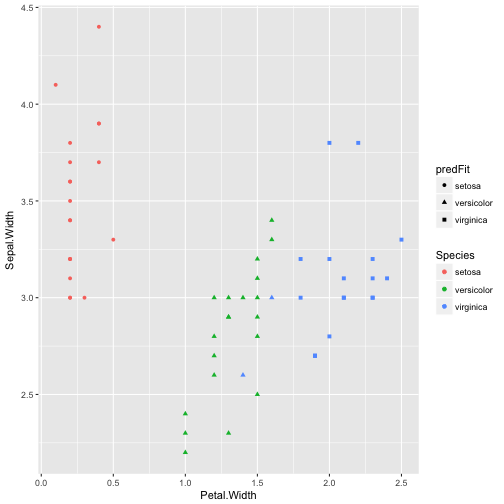

Reproducible Pitch Presentation
========================================================
author: Erik Johnson
date: 12/18/2017
autosize: true

Predicting Iris Species
========================================================
### An Interactive Machine Learning Model

- A shiny app that uses machine learning to predict plant species from the iris dataset.
- Allows the user to tweak the model parameters and machine learning algorithms to create more accurate models.

Model Creation
========================================================
The shiny app uses the caret package and one of five user-selectable algorithms to train a machine learning model on the iris data and estimate the model accuracy.


```r
fit <- train(Species ~ ., data=training, method="rf")
predFit <- predict(fit, testing)
confFit <- confusionMatrix(testing$Species, predFit)
confFit$overall["Accuracy"]
```

```
 Accuracy 
0.9666667 
```

Interactive Results
========================================================


Empowers Exploration
========================================================
The app gives the user the tools to discover the best prediction model for the data:

- Choose between five different machine learning algorithms: rf, rpart, gba, nb, lda
- Choose the size of the training/testing datasets
- Choose the parameter tweaking method:
    - Bootstrap
    - Cross-validation
